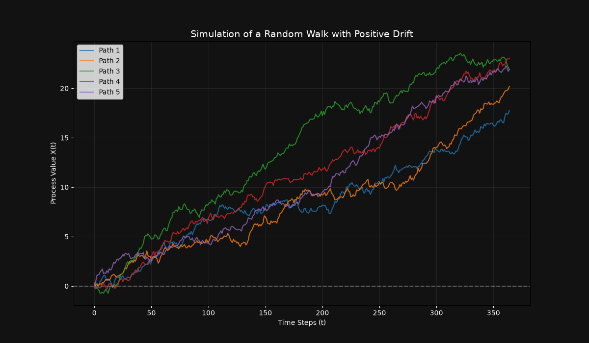
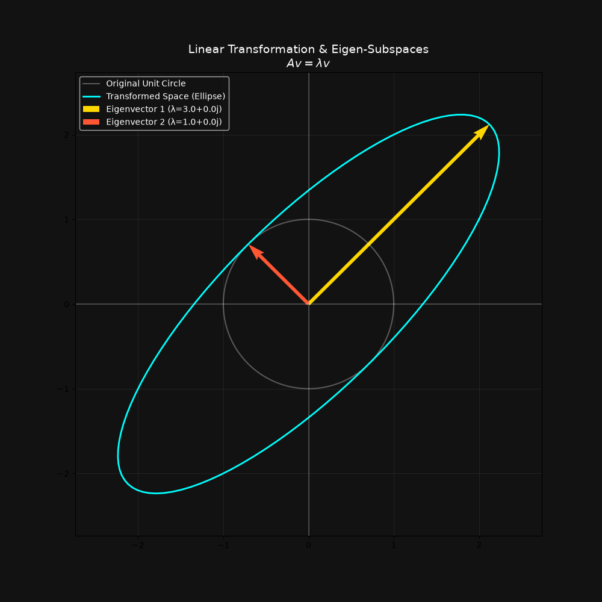
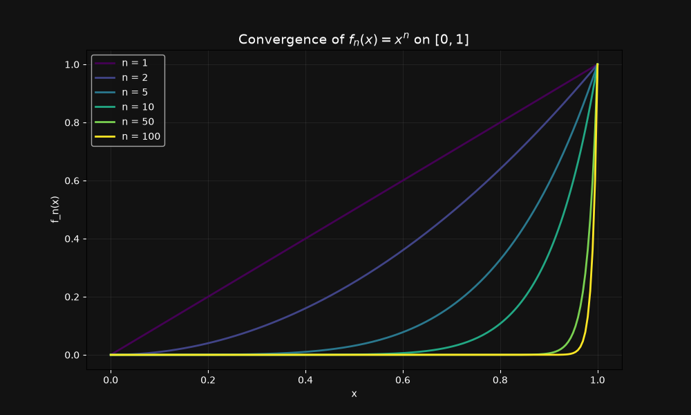
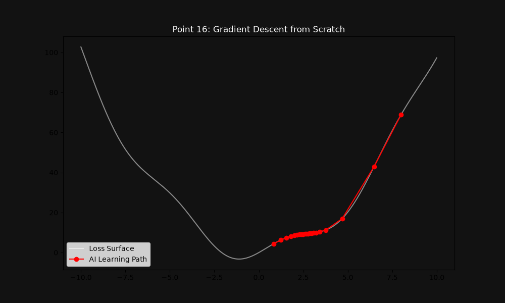
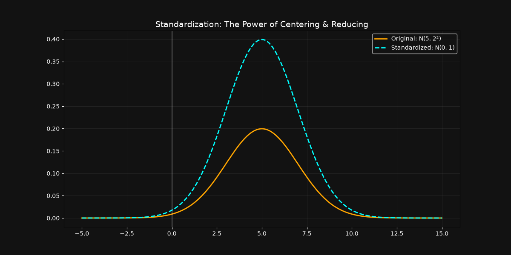
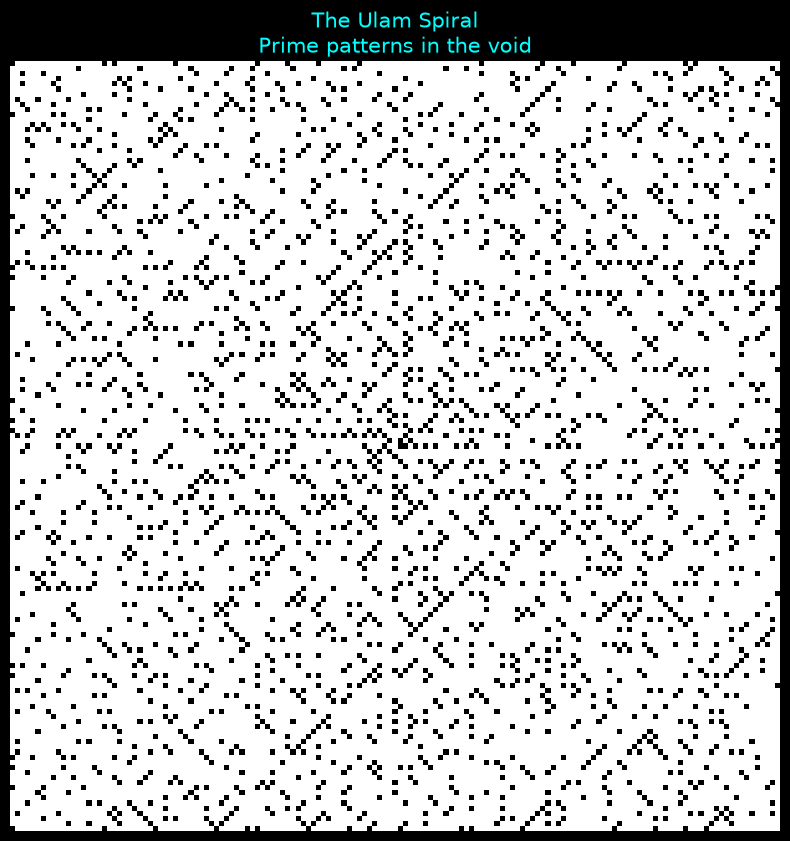
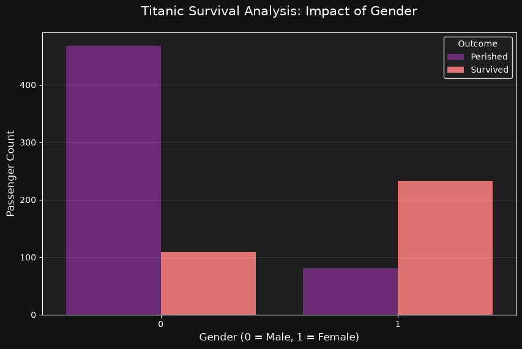

# Computational Mathematics Insights

[](https://www.python.org/)
[]()
[](https://opensource.org/licenses/MIT)

This repository documents my academic journey in Mathematics, focusing on the bridge between theoretical foundations and computational implementation.

## 🎯 Research Vision

I am a Mathematics student (L2) dedicated to mastering **Applied Mathematics and Artificial Intelligence**.

---

## 📂 Project Showcase

### 0. 🦋 Chaos Theory: The Lorenz Attractor
- **Code:** [lorenz_attractor.py](./Chaos_Theory/lorenz_attractor.py)

Modeling a system of three coupled non-linear ordinary differential equations (ODEs). This project visualizes the "Butterfly Effect," where tiny changes in initial conditions lead to vastly different outcomes.

<p align="center">
  
</p>

---

### 1. 📐 Linear Algebra: Mapping & Transformations
- **Code:** [matrix_viz.py](./Linear-Algebra/matrix_viz.py)

Visualizing how linear mappings $f: \mathbb{R}^2 \to \mathbb{R}^2$ transform the standard basis.

<p align="center">
  
</p>

### 2. 📈 Calculus: Convergence of Taylor Series
- **Code:** [taylor_sin_viz.py](./Calculus/taylor_sin_viz.py)

Analyzing the local approximation of functions through Taylor-Young expansions.

<p align="center">
  
</p>

### 3. 🛡️ Linear Algebra: Vector Analysis Tool
- **Code:** [vector_analysis_2d.py](./Linear-Algebra/vector_analysis_2d.py)

An interactive terminal-based tool developed from scratch to evaluate linear independence (Determinant) and orthogonality (Scalar Product) in $\mathbb{R}^2$.

### 4. 🧠 Calculus/Optimization: Hessian Matrix Analysis
- **Code:** [hessian_analysis.py](./Calculus/hessian_analysis.py)

A multivariable calculus tool that automates the search for critical points and classifies them (Local Minimum, Maximum, or Saddle Point) using the Gradient and the Hessian Matrix.

### 5. ♾️ Calculus: Integral Visualization
- **Code:** [integral_visualization.py](./Calculus/integral_visualization.py)

Visualizing the definite integral as the area under a curve $f(x) = x^2$ using numerical integration concepts.

<p align="center">
  
</p>

### 6. 🎲 Probability: Stochastic Random Walk
- **Code:** [random_walk_drift.py](./Probability/random_walk_drift.py)

Simulation of a discrete-time random walk with a positive drift. This project illustrates how deterministic effort can overcome stochastic volatility over time.

<p align="center">
  
</p>

### 7. 💎 Linear Algebra: Eigen-Analysis Geometry
- **Code:** [eigen_analysis_2d.py](./Linear-Algebra/eigen_analysis_2d.py)

Visualizing the geometric essence of Eigenvalues and Eigenvectors. This project shows how a matrix $A$ transforms a unit circle into an ellipse, highlighting the invariant directions (Eigenvectors) and their scaling factors (Eigenvalues).

<p align="center">
  
</p>

### 8. 📈 Calculus: Power Series Convergence Analyzer
- **Code:** [convergence_analyzer.py](./Calculus/convergence_analyzer.py)

An automated tool to compute the **Radius of Convergence** $R$ of a power series $\sum a_n x^n$. It uses D'Alembert's Ratio Test through symbolic computation.

### 9. 💎 Advanced Algebra & Calculus: Spectral Theory & Symbolic Integration
- **Code:** [spectral_convergence.py](./Calculus/spectral_convergence.py)

A dual-purpose scientific module demonstrating the power of symbolic computation in high-level mathematics.

- **Spectral Analysis:** Automated verification of matrix symmetry and application of the **Spectral Theorem** to find orthogonal bases and eigenvalues.
- **Generalized Calculus:** Symbolic evaluation of improper integrals (Riemann convergence at $+\infty$), including the Gaussian integral $\int_{0}^{+\infty} e^{-t^2} dt$.
- **Tool:** Using `SymPy` for exact mathematical proofs rather than numerical approximations.

### 10. 📉 Analysis: Sequences of Functions & Convergence
- **Code:** [function_convergence.py](./Calculus/function_convergence.py)

Visualizing the convergence of the sequence of functions $f_n(x) = x^n$ on the interval $[0, 1]$. This simulation highlights the behavior of pointwise vs. uniform convergence.

- **Mathematical Insight:** As $n \to \infty$, the sequence converges to a discontinuous limit function, demonstrating the loss of continuity when convergence is not uniform.
- **Tools:** `NumPy` for discrete point generation and `Matplotlib` with the `Viridis` colormap for scientific rendering.

<p align="center">
  
</p>

### 11. 🤖 AI Foundations: Gradient Descent
- **Code:** [gradient_descent_optimization.py](./AI-Foundations/gradient_descent_optimization.py)

Implementation of the fundamental optimization algorithm used in Deep Learning. This project bridges **Calculus** (derivatives) and **Algorithmic Learning**.

- **Concept:** Minimizing a loss function by iteratively moving in the direction of the steepest descent.
- **Visualization:** Tracking the path of the "optimizer" along the cost surface.

<p align="center">
  
</p>

### 12. 📊 Statistics: Normal Distribution & Standardization
- **Code:** [normal_distribution_viz.py](./Probability/normal_distribution_viz.py)

Visualizing the transformation of a general normal distribution $\mathcal{N}(\mu, \sigma^2)$ into a Standard Normal Distribution $\mathcal{N}(0, 1)$.

- **Mathematical Concept:** Implementation of the Z-score transformation (Centering and Reducing). This process is fundamental in Machine Learning for feature scaling and data normalization.
- **Visual Insight:** The plot demonstrates how reducing the variance $\sigma$ increases the peak of the density function to maintain a total area (integral) of 1.
- **Libraries:** `SciPy` for statistical functions and `NumPy` for vector operations.

<p align="center">
  
</p>

### 13. 🌀 Number Theory: The Ulam Spiral
- **Code:** [ulam_spiral.py](./Probability/ulam_spiral.py)

A visualization of the distribution of prime numbers in a 2D grid. Starting from the center and spiraling outwards, each highlighted pixel represents a prime number.

- **The Mystery:** Despite the chaotic appearance of prime numbers, this spiral reveals clear diagonal patterns (Ulam's lines) that remain unexplained in the general case.
- **Algorithm:** Implementation of a square spiral generator with an incremental step logic for high stability.
- **Visual:** "Prime patterns in the void" rendered with a dark scientific theme.

<p align="center">
  
</p>

### 14. 🌿 Fractals: The Barnsley Fern
- **Code:** [barnsley_fern.py](./Chaos_Theory/barnsley_fern.py)

Generating complex biological structures using Iterated Function Systems (IFS). This project combines **Probability Theory** and **Linear Algebra** to simulate the growth of a fern.

- **Concept:** Four affine transformations applied stochastically to a single point.
- **Visual:** Emergent complexity from simple matrix operations.

<p align="center">
  
</p>

### 15. 🚢 Machine Learning: Titanic Survival Prediction
- **Code:** [titanic_analysis.py](./Machine-Learning/Titanic-Classification/titanic_analysis.py)

Implementation of a Binary Classification model using **Logistic Regression**. This project bridges the gap between **Probability Theory** and **Predictive Modeling**.

- **Mathematical Concept:** Using the Sigmoid activation function $\sigma(z) = \frac{1}{1 + e^{-z}}$ to map linear combinations of features to probabilities.
- **Data Engineering:** Features encoding (Gender) and mean imputation for missing values.
- **Performance:** Achieved an accuracy of ~80% on unseen test data.

<p align="center">
  
</p>

---

## 📂 Repository Structure

```text
.
├── Linear-Algebra/      # Matrix mappings & Vector analysis
├── Calculus/            # Taylor Series & Multivariable Optimization
├── Machine-Learning/    # Predictive modeling & Binary classification
│   └── Titanic-Classification/
├── Probability/         # Stochastic processes & Random walks
└── README.md            # Project documentation
```

## 🛠️ Technical Stack

- **Language:** Python 3.12+
- **Math Engines:** NumPy, SymPy (Symbolic Math)
- **Visualization:** Matplotlib
- **Typesetting:** LaTeX ($\LaTeX$)

## 🗺️ Future Roadmap

- [x] **Eigenvalues & Eigenvectors:** Visualizing characteristic subspaces.
- [x] **Numerical Optimization:** Hessian-based critical point classification.
- [x] **Differential Equations:** Modeling dynamic systems using ODE solvers.

---

## 🚀 Getting Started

### Install dependencies
```bash
pip install numpy matplotlib sympy
```

### Clone and run
```bash
git clone https://github.com/taha108/Computational-Math-Insights.git
python Calculus/hessian_analysis.py
```