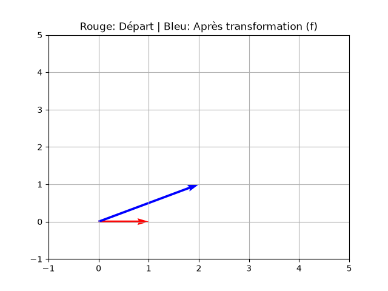

# Computational Mathematics Insights 🇨🇦

This repository documents my journey through Linear Algebra and its computational applications.

## 📊 Matrix Transformations
Visualizing how a matrix $A$ transforms the basis vector $e_1$. 

*Red: Basis vector | Blue: Transformed vector*