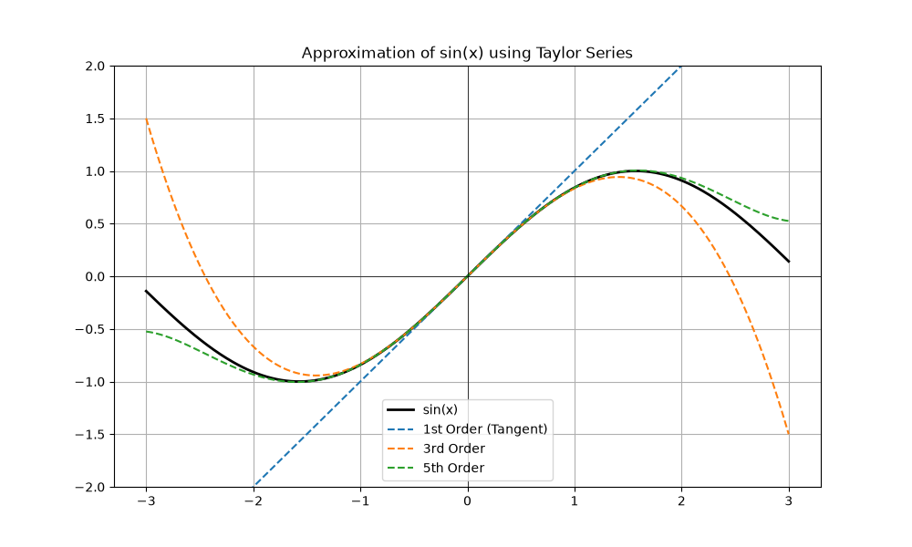
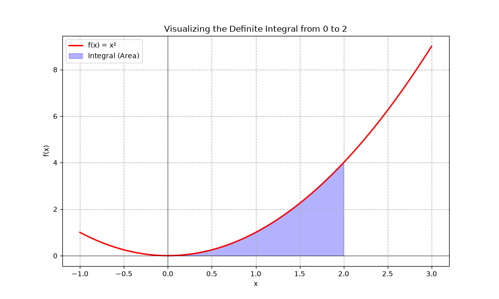

# Computational Mathematics Insights

[](https://www.python.org/)
[]()
[](https://opensource.org/licenses/MIT)

This repository documents my academic journey in Mathematics, focusing on the bridge between theoretical foundations and computational implementation.

## 🎯 Research Vision

I am a Mathematics student (L2) dedicated to mastering **Applied Mathematics and Artificial Intelligence**.

---

## 📂 Project Showcase

### 0. 🦋 Chaos Theory: The Lorenz Attractor
- **Code:** [lorenz_attractor.py](./Chaos_Theory/lorenz_attractor.py)

Modeling a system of three coupled non-linear ordinary differential equations (ODEs). This project visualizes the "Butterfly Effect," where tiny changes in initial conditions lead to vastly different outcomes.

<p align="center">
  
</p>

---

### 1. 📐 Linear Algebra: Mapping & Transformations
- **Code:** [matrix_viz.py](./Linear-Algebra/matrix_viz.py)

Visualizing how linear mappings $f: \mathbb{R}^2 \to \mathbb{R}^2$ transform the standard basis.

<p align="center">
  
</p>

### 2. 📈 Calculus: Convergence of Taylor Series
- **Code:** [taylor_sin_viz.py](./Calculus/taylor_sin_viz.py)

Analyzing the local approximation of functions through Taylor-Young expansions.

<p align="center">
  
</p>

### 3. 🛡️ Linear Algebra: Vector Analysis Tool
- **Code:** [vector_analysis_2d.py](./Linear-Algebra/vector_analysis_2d.py)

An interactive terminal-based tool developed from scratch to evaluate linear independence (Determinant) and orthogonality (Scalar Product) in $\mathbb{R}^2$.

### 4. 🧠 Calculus/Optimization: Hessian Matrix Analysis
- **Code:** [hessian_analysis.py](./Calculus/hessian_analysis.py)

A multivariable calculus tool that automates the search for critical points and classifies them (Local Minimum, Maximum, or Saddle Point) using the Gradient and the Hessian Matrix.

### 5. ♾️ Calculus: Integral Visualization
- **Code:** [integral_visualization.py](./Calculus/integral_visualization.py)

Visualizing the definite integral as the area under a curve $f(x) = x^2$ using numerical integration concepts.

<p align="center">
  
</p>

---

## 📂 Repository Structure

```text
.
├── Linear-Algebra/      # Matrix mappings & Vector analysis
├── Calculus/            # Taylor Series & Multivariable Optimization
└── README.md            # Project documentation
```

## 🛠️ Technical Stack

- **Language:** Python 3.12+
- **Math Engines:** NumPy, SymPy (Symbolic Math)
- **Visualization:** Matplotlib
- **Typesetting:** LaTeX ($\LaTeX$)

## 🗺️ Future Roadmap

- [ ] **Eigenvalues & Eigenvectors:** Visualizing characteristic subspaces.
- [x] **Numerical Optimization:** Hessian-based critical point classification.
- [ ] **Differential Equations:** Modeling dynamic systems using ODE solvers.

---

## 🚀 Getting Started

### Install dependencies
```bash
pip install numpy matplotlib sympy
```

### Clone and run
```bash
git clone https://github.com/taha108/Computational-Math-Insights.git
python Calculus/hessian_analysis.py
```